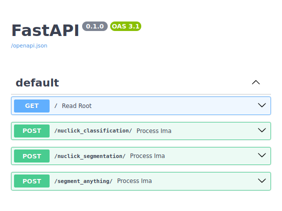

## AI Adapter for Digital Slide Archive

The AI Adapter facilitates the connection of pre-built and custom AI models with the [Digital Slide Archive](https://github.com/DigitalSlideArchive/digital_slide_archive). This integration empowers users to leverage AI models for the analysis of digital histopathology data and for the purpose of prototyping and testing AI models within the DSA environment. The AI Adapter offers four key features:

**Access to Pre-built AI Models for Analysis**: Directly access AI models such as Nuclick and Segment anything (Facebook) from the platform, enabling seamless analysis of histopathology images.

**Connect Custom AI Inference Models**: Seamlessly connect custom AI inference models to the DSA platform.

**Configure AI Model Parameters**: Customize AI model parameters by modifying this repository `aiInferenceModel`.

**Visualize AI Model Output**: Easily visualize the results generated by AI models within the DSA interface and save them to specific locations.

*Created by [Subin Erattakulangara](www.subinek.com)*

### Installation instructions

#### Step 1 - Install DSA adapater for AI models
Help users to deploy and run the AI applications with Digital slide archive

Following are the steps needed to download and deploy the AI adapter

```shell
git pull https://github.com/DigitalSlideArchive/dsa-run-custom-ai-models.git
```
```shell
cd dsa-run-custom-ai-models
```
```shell
docker build --force-rm -t dsarchive/runcustomaimodels .
```
check if the docker image is present using the command
```shell
docker images
```
You should be able to locate the Docker image named `dsarchive/runcustomaimodels` in order to proceed. Once you've successfully confirmed its presence, proceed to add the AI adapter to the DSA platform by following the provided tutorial.


Once you receive a success message from the platform confirming that the Docker has been successfully added, you can validate this by navigating to the Digital Slide Archive platform and performing the following steps.


#### Step 2 - Deploying the AI Models
Deploys AI models seperately as a service. Users can add or remove AI models from this codebase.
Following are the steps needed to setup the API
&nbsp;

##### Method 1 - Using Docker

To run the AI model using Docker, follow these steps:

1. Navigate to the `aiInferenceModel` directory:

    ```shell
    cd aiInferenceModel
    ```

2. Build the Docker image:

    ```shell
    docker build -t dsarchive/aimodels .
    ```

3. Run the Docker container:

    ```shell
    docker run -t -d -p 8017:80 --name aimodels dsarchive/aimodels
    ```

4. Verify the status of the Docker image:

    ```shell
    docker images
    ```

5. To ensure that the API is running, open the following URL in your web browser:

    ```shell
    http://localhost:8017/docs
    ```

    If you can see the API documentation, it means the AI models are successfully running in your environment.


&nbsp;

##### Method 2 - Using Conda

Alternatively, you can run the AI models without Docker by creating a Conda environment and installing all the requirements:

1. Create a Conda environment:

    ```shell
    conda create -n dsaAiModels python=3.11
    ```

2. Activate the Conda environment:

    ```shell
    conda activate dsaAiModels
    ```

3. Navigate to the `aiInferenceModel` folder:

    ```shell
    cd aiInferenceModel
    ```

4. Install all the requirements:

    ```shell
    pip install -r requirements.txt
    ```

5. Run the `main.py` file:

    ```shell
    python main.py
    ```

    This will start the FAST API interface for the AI applications.

## How it Works

1. The provided Docker build command above constructs a Docker instance that includes both the user interface (UI) and backend necessary for integration with DSA.

2. Within the `ai-inference-model` folder, you'll find `run-ai-inferencing.py`, a FAST-API package designed to containerize your AI model.

3. After connecting your custom AI model, you can deploy the Docker container by running `docker build run-custom-ai-model`.

4. Once the Docker container is initialized, You can choose and run the ai model required.

5. Press the "Submit" button to initiate the analysis.
