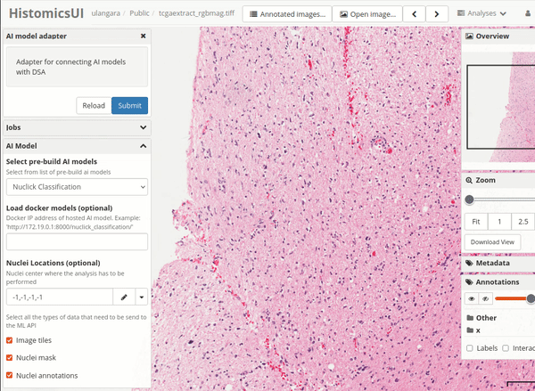

# Nuclei Classification with NuClick

The AI model is built based on the research paper titled *["NuClick: A Deep Learning Framework for Interactive Segmentation of Microscopy Images"](https://arxiv.org/abs/2005.14511)* authored by Navid Alemi Koohbanani, Mostafa Jahanifar, Neda Zamani Tajadin, and Nasir Rajpoot.

*Tutorial Created by [Subin Erattakulangara](www.subinek.com)*

## Overview
This AI model classifies nuclei from digital histopathology images into four different classes based on their characteristics. Colored bounding
boxes are provided as the output for the users to recognize the type of nuclei present in the sample:

| Class Number | Type of Nuclei       | Bounding box color                |
| ------ | --------------------- | -------------------- |
| 0      | Others           |       Blue           |
| 1      | Inflammatory    |       Green           |
| 2      | Epithelial        |       Red          |
| 3      | Spindle Shaped |       Yellow            |
| 4      | Cannot be processed |    Pink          |

### Using the Nuclick classification with DSA

1. Navigate to the DSA module `runCustomAIModel`.

&nbsp;

2. Select **"NuClick Classification"** from the dropdown menu for AI models.
&nbsp;

3. Determine the Region of Interest (ROI) and submit the request.
