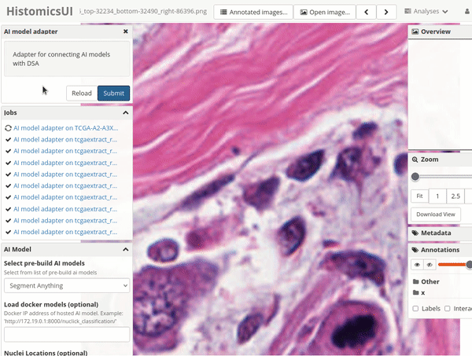
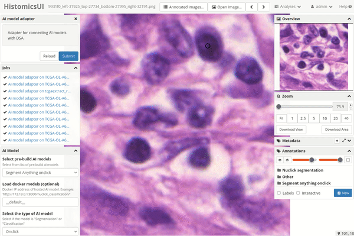

# Segment anything

The segment anything model used here is build by the Facebook team. The model weight is published based on the research paper
*[Segment Anything](https://arxiv.org/abs/2304.02643)*: Kirillov, Alexander and Mintun, Eric and Ravi, Nikhila and Mao, Hanzi and Rolland, Chloe and Gustafson, Laura and Xiao, Tete and Whitehead, Spencer and Berg, Alexander C. and Lo, Wan-Yen and Doll{\'a}r, Piotr and Girshick, Ross

*Tutorial Created by [Subin Erattakulangara](www.subinek.com)*

## Overview
Efficiently segment all entities within the provided image, including nuclei and a wide array of boundaries. Notably, the SAM model employed for this task is a more substantial and sophisticated model compared to the other AI models available here. Consequently, when processing larger images, one should anticipate potentially longer processing times.

### Using the Segment anything with HIstomicsTK

1. Navigate to the DSA module `runCustomAIModel`.

&nbsp;

2. Select **"Segment Anything"** from the dropdown menu for AI models.
&nbsp;

3. Determine the Region of Interest (ROI) and submit the request.

#### Segment anything onclick with HistomicsTK
In this particular section, the Segment Anything Model requires user input to initiate the segmentation process. This input serves as a guiding parameter for the segmentation, allowing the model to precisely delineate the specified object of interest within the input slide image. This functionality can be applied to segment various entities, such as nuclei or any enclosed objects, within the image.

