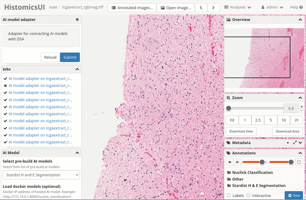

# StarDist - Object Detection with Star-convex Shapes
StarDist is an excellent choice for accurately segmenting nuclei in whole slide images. It's a lightweight AI model based on the Unet model in TensorFlow, designed to quickly and effectively segment nuclei from images. This model offers versatility, with different variants of StarDist tailored for nuclei segmentation in fluorescence imaging and hematoxylin and eosin stain. We've successfully implemented this AI model for nuclei segmentation in H&E stained images.

The StarDist model is built on the foundations of two key publications:
a) *[Cell Detection with Star-convex Polygons](https://arxiv.org/abs/1806.03535)* by Uwe Schmidt, Martin Weigert, Coleman Broaddus, and Gene Myers.
b) *[Star-convex Polyhedra for 3D Object Detection and Segmentation in Microscopy](https://arxiv.org/pdf/2306.14289.pdf)* by Martin Weigert, Uwe Schmidt, Robert Haase, Ko Sugawara, and Gene Myers.

*Tutorial Created by [Subin Erattakulangara](www.subinek.com)*

## Overview
The following figure illustrates the general approach for 2D images. The training data consists of corresponding pairs of input (i.e. raw) images and fully annotated label images (i.e. every pixel is labeled with a unique object id or 0 for background). A model is trained to densely predict the distances (r) to the object boundary along a fixed set of rays and object probabilities (d), which together produce an overcomplete set of candidate polygons for a given input image. The final result is obtained via non-maximum suppression (NMS) of these candidates.

### Using the Segment anything with HIstomicsTK

1. Navigate to the DSA module `runCustomAIModel`.

&nbsp;

2. Select **"Stardist H and E Segmentation"** from the dropdown menu for AI models.
&nbsp;

3. Determine the location to segment nuclei by using the ROI tool.
&nbsp;

4. Select *Whole Slide* method from the drop down menu
&nbsp;

5. Provide tick mark to both *Image tiles* and *Nuclei mask* since that information is required by the AI model
&nbsp;

6. Submit to generate the result.

